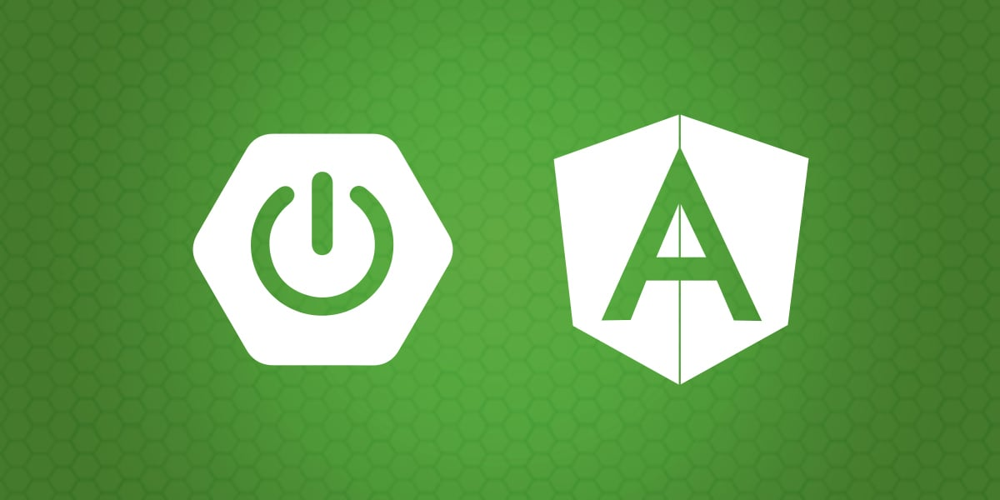

# Curso Desarrollo Web con Java

  

## Sesiones grabadas

- [Desarrollo web con Java - Sesión 3 - YouTube](https://youtu.be/kxKb09WOjc0)

- [Desarrollo web con Java - Sesión 4 - YouTube](https://youtu.be/9sxKqlLb3zM)

- [Desarrollo web con Java - Sesión 5 - YouTube](https://youtu.be/ucnhauGTZ34)

- [Desarrollo web con Java - Sesión 6 - YouTube](https://youtu.be/NHS7zcTGoFU)

- [Desarrollo web con Java - Sesión 7 - YouTube](https://youtu.be/5ekkmQC0uoo)

- [Desarrollo web con Java - Sesión 8 - YouTube](https://youtu.be/U4mFIu2F5kc)

## Proyectos de referencia

- [akobashikawa/angular-personas: Frontend para express-personas o spring-boot-personas](https://github.com/akobashikawa/angular-personas)
- [akobashikawa/springboot-personas: Ejemplo de API REST usando Spring Boot](https://github.com/akobashikawa/springboot-personas)

## Enlaces útiles

- Learn Git Branching: https://learngitbranching.js.org/
- DevDocs API Documentation: https://devdocs.io/
- NotebookLM: https://notebooklm.google.com/
- Testing Spring Boot Applications Made Simple: https://rieckpil.de/
