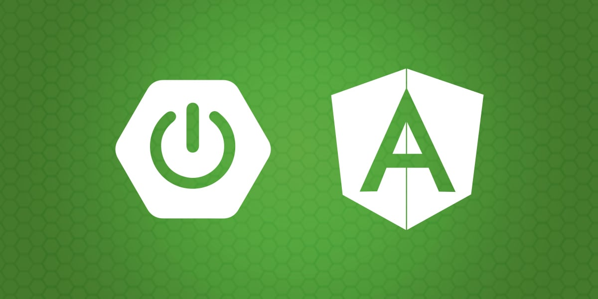

# Curso Desarrollo Web con Java

  

## Sesiones grabadas

- [Desarrollo web con Java - Sesión 3 - YouTube](https://youtu.be/kxKb09WOjc0)
<iframe width="560" height="315" src="https://www.youtube.com/embed/kxKb09WOjc0?si=Z118wBOo8UoBa7Ql" title="YouTube video player" frameborder="0" allow="accelerometer; autoplay; clipboard-write; encrypted-media; gyroscope; picture-in-picture; web-share" referrerpolicy="strict-origin-when-cross-origin" allowfullscreen></iframe>

- [Desarrollo web con Java - Sesión 4 - YouTube](https://youtu.be/9sxKqlLb3zM)
<iframe width="560" height="315" src="https://www.youtube.com/embed/9sxKqlLb3zM?si=5CNXKmVovsFq8-Lv" title="YouTube video player" frameborder="0" allow="accelerometer; autoplay; clipboard-write; encrypted-media; gyroscope; picture-in-picture; web-share" referrerpolicy="strict-origin-when-cross-origin" allowfullscreen></iframe>

- [Desarrollo web con Java - Sesión 5 - YouTube](https://youtu.be/ucnhauGTZ34)
<iframe width="560" height="315" src="https://www.youtube.com/embed/ucnhauGTZ34?si=Gy7prDHxJjusxVV3" title="YouTube video player" frameborder="0" allow="accelerometer; autoplay; clipboard-write; encrypted-media; gyroscope; picture-in-picture; web-share" referrerpolicy="strict-origin-when-cross-origin" allowfullscreen></iframe>

- [Desarrollo web con Java - Sesión 6 - YouTube](https://youtu.be/NHS7zcTGoFU)
<iframe width="560" height="315" src="https://www.youtube.com/embed/NHS7zcTGoFU?si=ym8UD1FLnOXczECf" title="YouTube video player" frameborder="0" allow="accelerometer; autoplay; clipboard-write; encrypted-media; gyroscope; picture-in-picture; web-share" referrerpolicy="strict-origin-when-cross-origin" allowfullscreen></iframe>

- [Desarrollo web con Java - Sesión 7 - YouTube](https://youtu.be/5ekkmQC0uoo)
<iframe width="560" height="315" src="https://www.youtube.com/embed/5ekkmQC0uoo?si=NNK27uFCUPGpbNRO" title="YouTube video player" frameborder="0" allow="accelerometer; autoplay; clipboard-write; encrypted-media; gyroscope; picture-in-picture; web-share" referrerpolicy="strict-origin-when-cross-origin" allowfullscreen></iframe>

- [Desarrollo web con Java - Sesión 8 - YouTube](https://youtu.be/U4mFIu2F5kc)
<iframe width="560" height="315" src="https://www.youtube.com/embed/U4mFIu2F5kc?si=UH19B0DVOXMezthD" title="YouTube video player" frameborder="0" allow="accelerometer; autoplay; clipboard-write; encrypted-media; gyroscope; picture-in-picture; web-share" referrerpolicy="strict-origin-when-cross-origin" allowfullscreen></iframe>

## Proyectos de referencia

- [akobashikawa/angular-personas: Frontend para express-personas o spring-boot-personas](https://github.com/akobashikawa/angular-personas)
- [akobashikawa/springboot-personas: Ejemplo de API REST usando Spring Boot](https://github.com/akobashikawa/springboot-personas)

## Enlaces útiles

- Learn Git Branching: https://learngitbranching.js.org/
- DevDocs API Documentation: https://devdocs.io/
- NotebookLM: https://notebooklm.google.com/
- Testing Spring Boot Applications Made Simple: https://rieckpil.de/
